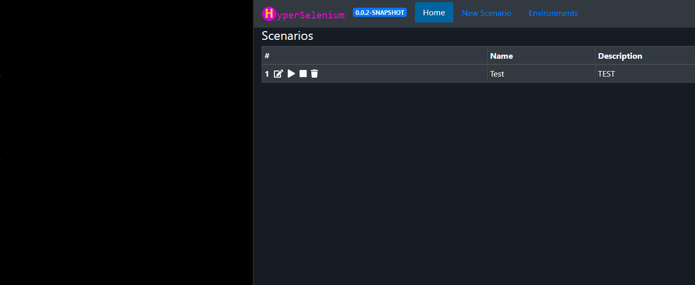
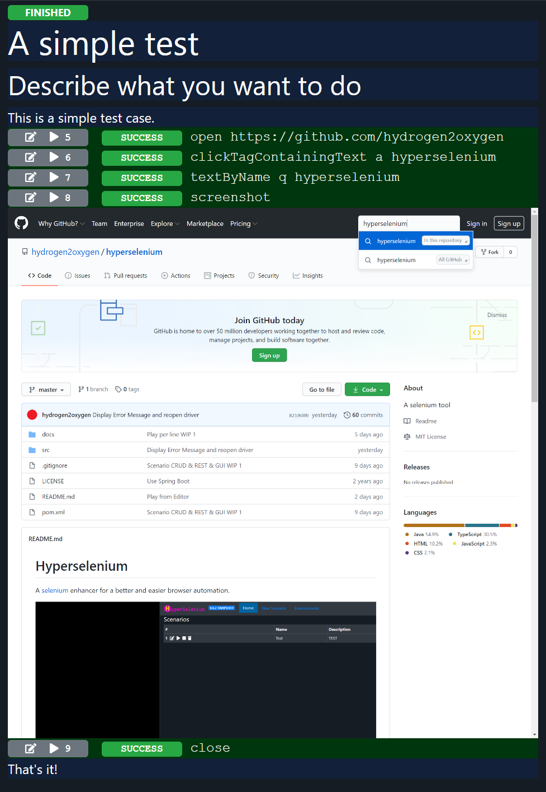

# Hyperselenium
A [selenium](https://www.selenium.dev) enhancer for a better and easier browser automation.

## Intention
Why Hyperselenium? It uses Selenium for automation of the browser, but with an easy script language.
Indeed so easy, that you don't need to be a pro in software development for writing a script.

The format of a script is a simple MarkDown format.

You write text, descriptions and commands in a markdown code block.

Example:

    #url = https://github.com
    open #url
    clickLink Explore
    assertText "Here's what we found based on your interests"
    screenshot
    close

The result is a protocol, which can be edited or enhanced line by line.

- SNIPPET, every script with multiple actions can be reused as a snippets
- HTML / PDF WRAPPER, every test case result can be transformed into a readable protocol with screenshots
- PARAMETERS are automatically detected and you can use different sets of them for different environments
- SCRIPT or plain JAVA, whatever you need (Script uses simple actions and snippets)
- DESCRIPTION, you can explain what you expect and this will be included in the HTML/PDF protocol
- YES, NO, MAYBE, not every assert requires 100%, sometimes it is ok to get "something"
- PRECONDITIONS, some tests results in yellow instead of red when some preconditions are not fulfilled
- PREPARATION and REPEATABLE, some environments require some sort of preparation for repeatable tests (JDBC, SFTP)
- STOP, EDIT and CONTINUE, stop the test run whenever you need and adjust the script, then just continue the test
- SERVER, manage your tests and environments from a server application, trigger the tests, observe the results

... a work in progress ...

Take a look at the [new planned commands and features](NewFeaturesScript.md).

### COMMAND
During a "scenario" we have different [commands](docs/script.md).
Not all commands interacts with the browser.
Some actions save data, runs SQL scripts, push data on a SFTP folder, delete stuff, asserts variables,
or just print notes into the HTML/PDF protocol.

The interactions with the browser are simple Selenium commands.

#### JavaScript
Java is able to interpret JavaScript, so if necessary we can use JavaScript for more complex tasks without the need to write a dedicated command.

### PROTOCOL
A protocol of a scenario saves the result of each step and some additional notes and screenshots. They can be rendered into HTML/PDF.

### SCENARIO
A scenario is a test case or a use case. Selenium is not just used to test something, but it is also a tool to prepare something. If you scenario acts as a test case, then it will contain a series of asserts.

# Selenium Grid Setup
    docker run -d -p 4444:4444 --shm-size 2g selenium/standalone-firefox:4.0.0-alpha-7-prerelease-20201009
    
    
In Settings check the seleniumGridRemoteUrl and the seleniumDriverType (REMOTE_CHROME or REMOTE_FIREFOX).
Use multiple instances of HyperSelenium server for different types of browsers (best practice).

# TODOs
## JGIT
Deploy hyperselenium inside a docker or on a server, then let it load a git repository with the tests. You can use multiple instances for performance tests.

## Plugins
Evaluating different plugin architecture / frameworks:

- https://stackoverflow.com/questions/32901188/implementing-plugin-architecture-in-annotation-based-spring-boot-application
- https://github.com/spring-projects/spring-plugin
- https://pf4j.org/

Commands could be implemented just by loading an external library with commands inside the "net.hydrogen2oxygen" package. They will be automatically discovered.

https://stackoverflow.com/questions/41148353/dynamically-add-jars-to-springboot-at-runtime

## Database
Nitrite Database (NoSQL) looks very nice: https://www.dizitart.org/nitrite-database.html

## Read Maven Version Number
https://stackoverflow.com/questions/38983934/cannot-get-maven-project-version-property-in-a-spring-application-with-value

## Docker Selenium Hub - HowTo

    docker run --restart unless-stopped selenium/standalone-chrome

TODO: https://www.baeldung.com/docker-java-api a Docker Client, for starting and stopping the Selenium Standalone Docker

## Rendering Markdown in Angular
https://medium.com/wizdm-genesys/rendering-markdown-in-angular-37750d124247

## Syntax Highlighting In Angular
https://medium.com/wizdm-genesys/syntax-highlighting-in-angular-b192f25d17b2
